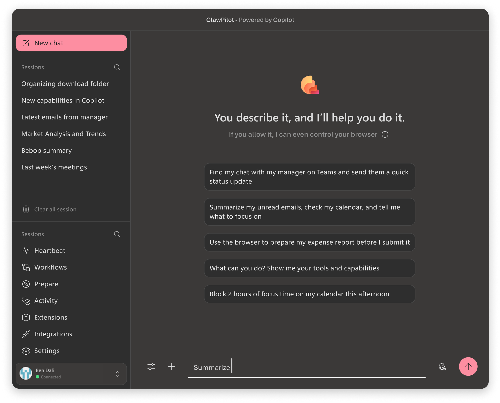

# 🦞 ClawPilot

A desktop-based, Copilot-powered daily driver that executes real tasks across your local system, browser, and Microsoft 365 — without switching tabs.

ClawPilot is an **execution-first** assistant. It doesn't just suggest — it acts.

---

## Core Capabilities

| Capability | What It Does |
|---|---|
| **File System** | Read, write, edit, and organize files and folders directly on your machine |
| **Shell / Terminal** | Run commands, install packages, and execute scripts with live output |
| **Browser Control** | Navigate sites, click buttons, fill forms, and extract data like a human user |
| **Web Search** | Perform live internet research and documentation lookups |
| **WorkIQ (M365)** | Query emails, meetings, Teams messages, and documents across Outlook, Teams, Calendar, and OneDrive |

---

## Skills & Workflows

- **Skills** — Repeatable workflows learned from your behavior, reusable without redefinition
- **Workflows** — Multi-step automations written in plain English (no code required)
  - Trigger on demand or on a natural-language schedule (*"every weekday at 9am"*)
  - Every run is logged with step-by-step execution history and one-click re-run

### Example Automations

- **Daily awareness** — Scans calendar, inbox, and Teams; notifies only when something is urgent
- **Expense reporting** — Reads receipts, opens the expense system, fills forms, categorizes spending, submits
- **Knowledge organization** — Analyzes notes, proposes structure, creates folders, moves files, explains the logic

---

## Skills Marketplace

Publish your skills with one click. Discover community skills by category, popularity, or search. Install instantly — no manual setup.

---

## Heartbeat (Background Monitoring)

Runs in the background and watches for urgent Teams messages, important emails, or critical escalations. Delivers macOS notifications so you stay in deep-focus mode.

---

## Teams Bridge (Remote Control)

Send requests from your Teams self-chat (including mobile). ClawPilot polls the chat, executes the task with full capabilities, and posts results back. No VPN or local app access required — Teams becomes your remote command interface.

---

## Personalities

Swap interaction styles on the fly: **TARS**, **JARVIS**, **Sarcastic Teenager**, **Enthusiastic Intern**, **David Attenborough**, **Marvin**, or write your own in natural language. Tone changes — capabilities don't.

---

## Model Flexibility

Switch language models mid-conversation. Supported models include Claude Opus 4.6, Claude Sonnet 4.5, GPT-5.2, GPT-5.1-Codex, Gemini 3 Pro, and more.

---

## Platform & Security

- **macOS** and **Windows** with code-signed installers
- Built with Copilot integration
- M365 access requires explicit opt-in (dogfood tenant with admin consent)
- Non-M365 features (GitHub, shell, browser, file access) work independently

---

## What Makes ClawPilot Different

- Full local machine control (files, shell, browser)
- Native Microsoft 365 workplace intelligence
- Natural-language automation and scheduling
- Community skill sharing via marketplace
- Teams as a remote execution interface
- Multi-model AI switching
- Execution-first design

---

## Links

- **Microsoft Official Repo:** [github.com/microsoft/openclaw](https://github.com/microsoft/openclaw)